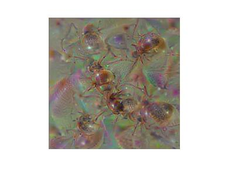
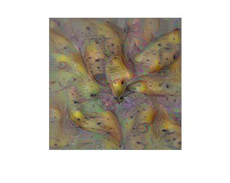
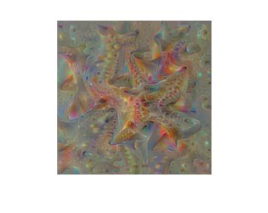
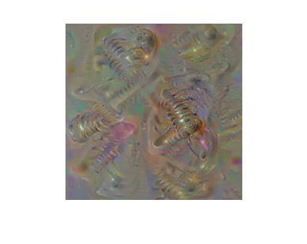

Inceptionism
===============

Aiming at reproducing Inceptionism described in http://googleresearch.blogspot.jp/2015/06/inceptionism-going-deeper-into-neural.html .

Some preliminary results has been generated. But their are still many drawbacks. If you want to try, please download GoogLeNet from 
Caffe model Zoo (https://github.com/BVLC/caffe/wiki/Model-Zoo). Other models is also supported, such as VGGnet, PlaceCNN etc. I have also uploaded the GoogLeNet model files to my Baidu YunDisk (http://pan.baidu.com/s/1dDpSH01).

Certainly, the newest version of my Caffe in this repository should be installed, or you will not able to bp the gradient to the data layer.

Open inceptionism.m and change all the file paths to yours and run the script, you will get a fantasy image.

The max_idx variable refers to the class in ImageNet that you want to generate. The classes are listed in ImageNet2012_labels.txt 
of my Baidu YunDisk (http://pan.baidu.com/s/1dDpSH01).

Please feel free to change the switches to use some of the priors, such as tv-norm, weight decay, blur, clip etc. In my experiments, simultaneously using tv-norm and image bluring leads to the best performance.

Gallery
==============
2015/6/26 Bigger Images are generated.

megalith:

mixture of coral and starfish:

2015/6/25 Some more wonderful images are generated. Sorry that I could not tell the key technique until I have written a technique report. I will release the codes once I have uploaded the report.

ant:

banana:

canoe:

starfish:

screw:

